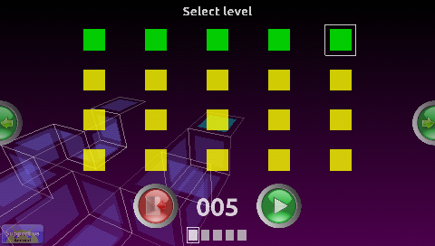
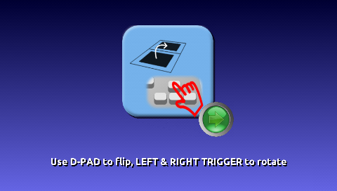
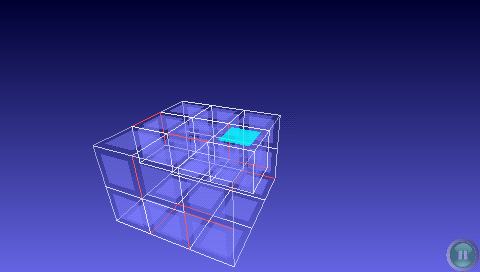
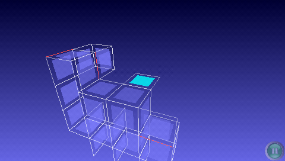
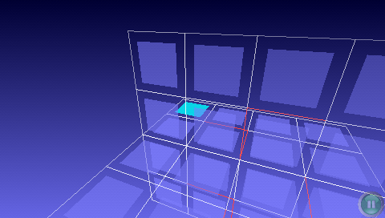
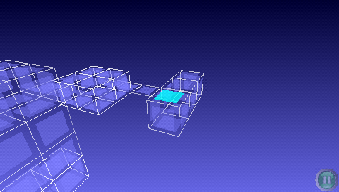

#Phlipple for Sony Playstation Portable

This is a Sony Playstation Portable port of Phlipple game, designed by Remigiusz Dybka.

https://sourceforge.net/projects/phlipple

Phlipple is a unique puzzle game. The goal of every level is to reduce a 3D shape to a single square. Elimination of squares is done by flipping edges around just like in a cardboard box.

It starts off relatively easy to teach the basics just to later on serve hours of brain tickling fun. It's a great way to train memory as well as orientation in 3D.

This port is based on Phlipple release 0.8.5

##Game screenshots

Screenshots of different game challenges

  
  
  
  
  
  

##Binary installation

https://github.com/bomblik/Phlipple_PSP/releases

Copy phlipple_0.8.5_psp directory to Sony PSP device
(e.g. to ms0:/psp/game directory on Memory Stick).

##Source installation

###Compilation

In order to compile Phlipple, please install psptoolchain
and set development environment.

To compile project invoke

    cd src
    make -f Makefile.psp

To prepare data for installation invoke

    make -f Makefile.psp release

That would create all required data in phlipple_0.8.5_psp directory

###Installation

Copy phlipple_0.8.5_psp directory to Sony PSP device
(e.g. to ms0:/psp/game directory on Memory Stick).

##Key mappings

    CROSS                    - confirm
    CIRCLE                   - cancel / exit game
    
    LEFT TRIGGER             - rotate scene counterclockwise
    RIGHT TRIGGER            - rotate scene clockwise

    D-PAD                    - flip squares

    TRIANGLE                 - toggle sound

